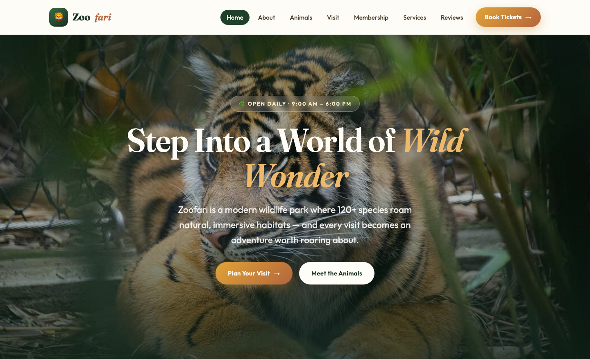

# 🦁 Zoofari — Modern Zoo &amp; Wildlife Park HTML Template

A premium, framework-free HTML template for a modern zoo and wildlife park. **Zoofari** pairs a bold "safari-wild" visual language — earthy greens and warm tans, editorial serif display type, and savanna-wide hero compositions — with 9 polished pages, token-driven CSS, and a single dependency-free JavaScript file for scroll reveals, mobile navigation, smooth anchors and form feedback.

Open `index.html` to explore the live demo.

---

## 📸 Screenshot

## Design System

| Token | Value | Role |
|---|---|---|
| `--forest-900` | `#16301f` | Deep forest — primary brand dark, footer, buttons |
| `--forest-700` | `#2a5337` | Forest green — headings, nav accents |
| `--forest-100` | `#e3efe1` | Soft leaf — section bands, icon wells |
| `--safari-500` | `#e0a437` | Golden savanna — primary accent, CTAs |
| `--safari-600` | `#c98a2b` | Amber — hover states, eyebrows |
| `--clay-600` | `#b4653d` | Terracotta — italic serif accents, gradients |
| `--tan-100` | `#f6f0e4` | Warm parchment — page background |
| `--ink-900` | `#221a10` | Dark cocoa — body text |
| `--white` | `#fffdf8` | Warm white — surfaces, cards |
| `--font-display` | `Fraunces` | Editorial serif — headlines, stats, prices |
| `--font-body` | `Outfit` | Clean geometric sans — body, UI |
| `--radius-lg` | `28px` | Organic rounded cards |
| `--shadow-lg` | `0 30px 70px …` | Deep ambient elevation |

The palette is defined once as CSS custom properties on `:root` and consumed everywhere via semantic tokens (`--color-brand`, `--color-accent`, `--color-muted`, …), so re-branding is a single edit.

---

## Pages

| Page | File | Highlights |
|---|---|---|
| Home | [index.html](index.html) | Crossfading hero, ticket strip, species showcase, services, habitat band, stats, testimonials, CTA |
| About | [about.html](about.html) | Story split, mission &amp; values, timeline, stats |
| Animals | [animal.html](animal.html) | Featured species cards, habitat zones, species grid |
| Visit | [visiting.html](visiting.html) | Ticket tiers, hours table, directions, gallery, FAQ |
| Membership | [membership.html](membership.html) | Member perks, pricing tiers, conservation impact |
| Services | [service.html](service.html) | Signature tours, services grid, alt feature rows |
| Reviews | [testimonial.html](testimonial.html) | Guest story cards, rating stats, memory gallery |
| Contact | [contact.html](contact.html) | Full contact form with validation, info cards |
| 404 | [404.html](404.html) | On-brand "trail gone wild" error page |

---

## Tech Stack

- **HTML5** — semantic landmarks, accessible forms, `details` FAQ, native lazy-loading
- **CSS3** — custom-property design tokens, CSS Grid &amp; Flexbox, `clamp()` fluid type, `aspect-ratio`, `backdrop-filter`, mobile-first breakpoints at ~980px and ~720px
- **Vanilla JavaScript** — one canonical file (`assets/js/main.js`) powering IntersectionObserver reveals, burger navigation, active-link highlighting, smooth anchor scrolling, hero crossfade, form feedback and back-to-top
- **Google Fonts** — Fraunces + Outfit, loaded via `fonts.googleapis.com` / `fonts.gstatic.com`
- **No frameworks, no build step, no dependencies** — works by opening the files directly or hosting on any static server

---

## Images

All imagery lives in `assets/img/` and is used by its real filename — no placeholder services.

| File(s) | Used for |
|---|---|
| `bg-1.jpg`, `bg-2.jpg` | Full-bleed hero and page-hero backdrops |
| `carousel-1..3.jpg` | Hero crossfade, galleries |
| `animal-lg-1..3.jpg` | Featured species / experience cards (portrait) |
| `animal-md-1..3.jpg` | Species grid, habitat diary cards (landscape) |
| `about.jpg` | Intro / story split media |
| `testimonial-1..3.jpg` | Reviewer avatars |
| `icon-1..10.png` | Service, feature and membership icons |

Swap these files in place (same names) to fully re-skin the template with your own photography.

---

## SEO

- Per-page unique `<title>` and meta description
- Semantic `header / nav / main / section / footer` landmarks
- Descriptive `alt` text on every image
- Emoji SVG favicon inline in every `<head>`
- **Keywords:** zoo template, wildlife park website, animal park HTML template, safari theme, zoo website, conservation, family day out, zoo membership, zoo tickets

---

## License

Free for personal and commercial use. Original source photographs are bundled for demo purposes; if you publish, consider replacing them with your own or licensed imagery. No attribution required.

---

### Let's Build Something Together 🚀

[https://tally.so/r/q4q1L9](https://tally.so/r/q4q1L9)
